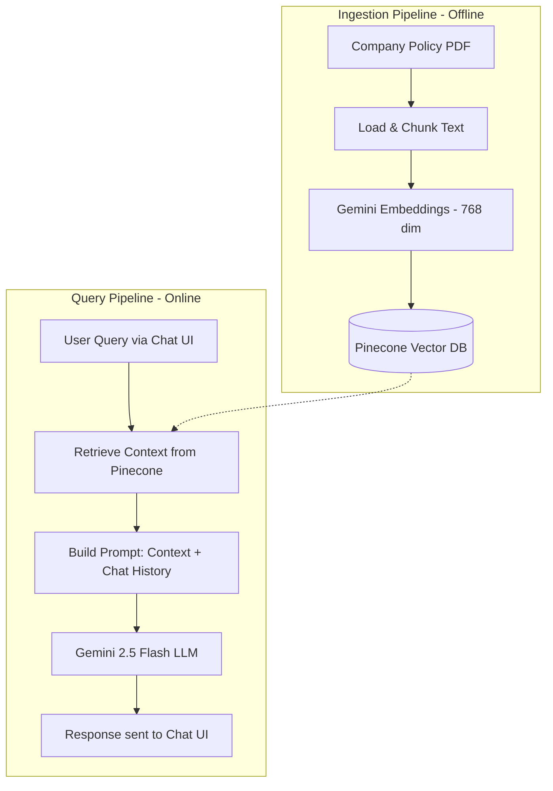

# 🤖 Company Policy Chatbot — RAG Architecture

[](https://nodejs.org)
[](https://expressjs.com)
[](https://langchain.com)
[](https://pinecone.io)
[](https://deepmind.google/technologies/gemini)

An **Enterprise HR Policy Chatbot** built using **Retrieval-Augmented Generation (RAG)**. It integrates Google Gemini and Pinecone to deliver factually grounded, context-aware answers about company policies (leaves, hybrid work, security rules) with multi-language support (English / Hindi / Hinglish).

---

## 📐 System Architecture

The system has two pipelines: **Document Ingestion** (offline) and **Query & Chat** (online runtime).



### RAG Architecture Diagram


### How RAG Works

Standard LLMs answer from static, pre-trained knowledge — which leads to **hallucinations** and inability to access private documents.

**RAG** solves this by:
1. **Retrieving** relevant passages from a private knowledge source (your policy PDF stored as vectors in Pinecone).
2. **Augmenting** the user's prompt with retrieved context + conversation history.
3. **Generating** a grounded response strictly based on verified context, in the user's language.

---

## 🗂️ Project Structure

```text
company-chatbot/
│
├── index.js                  # Express server + RAG chat engine
├── prepare.js                # PDF ingestion script (PDF → chunks → Pinecone)
├── package.json              # Dependencies & scripts
├── .env                      # API keys & config (not committed)
├── .gitignore                # Git ignore rules
├── Company_Policy_Handbook_Test_RAG.pdf  # Source policy document
│
├── frontend/                 # Static client served by Express
│   ├── index.html            # Landing page with embedded chatbot widget
│   ├── style.css             # Premium stylesheet (light theme, glassmorphism)
│   └── app.js                # Chat UI logic, session management & API calls
│
└── README.md                 # This file
```

---

## 🛠️ Tech Stack

| Layer | Technology | Purpose |
|:------|:-----------|:--------|
| **LLM** | Google Gemini 2.5 Flash | Generates answers from context |
| **Embeddings** | Gemini Embedding 001 (768-dim) | Converts text → vector embeddings |
| **Vector DB** | Pinecone | Stores & retrieves document vectors |
| **Framework** | LangChain.js v0.3 | Orchestrates RAG pipeline (prompts, chains, retrievers) |
| **Backend** | Express.js v4 | REST API server + static file serving |
| **Frontend** | Vanilla HTML/CSS/JS | Chat widget UI with markdown rendering |

---

## 🚀 Setup & Installation

### Prerequisites

- **Node.js** v22.0.0 or higher
- A **Pinecone** index (dimension: `768`, metric: `cosine`)
- A **Google Gemini API Key**

### 1. Clone the Repository

```bash
git clone https://github.com/ankurkushwaha809/Company-Chatbot.git
cd Company-Chatbot
```

### 2. Create a `.env` file

Create a `.env` file in the project root:

```env
GOOGLE_API_KEY="your_gemini_api_key"
PINECONE_API_KEY="your_pinecone_api_key"
PINECONE_INDEX_NAME="your_pinecone_index_name"
```

### 3. Install Dependencies

```bash
npm install --legacy-peer-deps
```

> **Note:** The `--legacy-peer-deps` flag is required due to peer dependency conflicts in LangChain community packages.

### 4. Ingest the PDF into Pinecone (First-Time Only)

This reads the PDF, splits it into chunks, generates embeddings, and uploads vectors to Pinecone:

```bash
npm start
```

> This runs `node prepare.js`. You only need to do this once (or whenever you update the PDF).

### 5. Start the Server

```bash
npm run dev
```

The server starts at **`http://localhost:3000`**. Open this URL in your browser to see the landing page with the chatbot widget.

---

## 💬 How to Use

1. Open `http://localhost:3000` in your browser.
2. Click the **chat bubble** (bottom-right corner) to open the AI assistant.
3. Ask questions about company policies in **English**, **Hindi**, or **Hinglish**.
4. The bot retrieves relevant context from Pinecone and generates grounded answers using Gemini.

---

## ⚡ Performance & Robustness Features

| Feature | Description |
|:--------|:------------|
| **Direct Retrieval** | Follow-up questions query Pinecone directly (no separate LLM rephrasing call), saving ~50% API calls |
| **Fail Fast (`maxRetries: 1`)** | Gemini retries set to 1 to prevent indefinite hanging on rate limits |
| **Smart Retry Handler** | Auto-retries on `429` (rate limit) and `503` (overloaded) errors with 2s delay |
| **Session-Based History** | Each user session maintains separate conversation history for contextual follow-ups |
| **History Pruning** | Chat history auto-prunes after 20 messages to prevent token overflow |
| **Crash-Proof Guards** | Global `unhandledRejection` and `uncaughtException` handlers keep the process alive |
| **CORS Enabled** | Frontend can also run independently (e.g., VS Code Live Server) |

---

## 🧪 Test Questions

Use these queries to validate the chatbot's retrieval accuracy across languages and edge cases:

| # | Style | Test Query | Expected Behavior |
|:--|:------|:-----------|:-------------------|
| 1 | English (Typos) | `can i save confidencial files on my persnal cloude?` | Refuses — confidential data prohibited on personal cloud |
| 2 | Hinglish | `mujee saal me total kitni chutiya millegi aur unka brekdown kya h?` | Lists 24 leaves: 12 casual, 6 sick, 6 privilege |
| 3 | English (Typos) | `what are the minimun days we must work from office every week?` | States hybrid work policy details |
| 4 | Hinglish | `employees ko apna kaam kiske sath align krna hota h?` | Mentions customer success, security, continuous improvement |
| 5 | English | `can i share my office login MFA or OTP with my manager?` | Refuses — credentials must remain private |
| 6 | Hinglish | `kya me bachi hui sick leavs agle sal carry forward kr skta hu?` | Confirms sick leaves don't carry forward |
| 7 | English (Typos) | `who is responsble for commnicating company overview expectations?` | Identifies managers as responsible |
| 8 | Hinglish | `kya me kisi dusri location se permanently remote kam kr skta hu?` | Explains HR & Dept Head approval needed |
| 9 | English | `can my family member use my office laptop for some urgent work?` | Refuses — devices strictly for employees only |
| 10 | Hinglish (Typos) | `kya me apni privilege leavs ko cash me convrt krva skta hu?` | Explains accumulation/encashment terms |

---

## 📜 Available Scripts

| Command | Description |
|:--------|:------------|
| `npm start` | Run `prepare.js` — ingest PDF into Pinecone |
| `npm run dev` | Run `index.js` — start the Express server |

---

## 📄 License

ISC